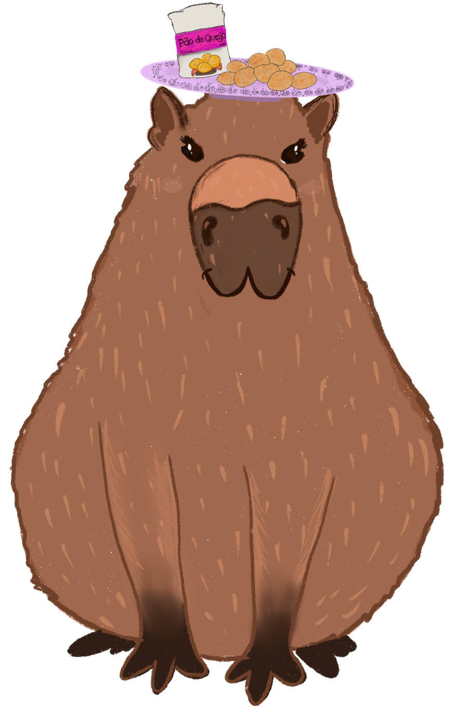

=============================================================================
Tutorial: DQ Robotics with `CoppeliaSim <https://www.coppeliarobotics.com/>`_
=============================================================================
|license| |visitors| |ubuntu| |windows| |mac|
|matlab| |python| |cpp| |coppelia|

.. |license| image:: https://img.shields.io/github/license/dqrobotics/matlab.svg

.. |visitors| image:: https://api.visitorbadge.io/api/visitors?path=https%3A%2F%2Ftutorial-dqrobotics-with-coppeliasim.readthedocs.io%2Fen%2Flatest%2Findex.html%23&countColor=%23ff69b4&style=plastic

.. |windows| image:: https://img.shields.io/badge/limited%20support-Windows-blue

.. |mac| image:: https://img.shields.io/badge/macOS-yellow

.. |ubuntu| image:: https://img.shields.io/badge/official%20support-Ubuntu%20LTS-orange

.. |python| image:: https://img.shields.io/pypi/pyversions/dqrobotics/21.4.0a75

.. |matlab| image:: https://img.shields.io/badge/Matlab-R2022b-green
.. |matlabactivity| image:: https://img.shields.io/github/commit-activity/y/dqrobotics/matlab
.. |matlabtest| image:: https://github.com/dqrobotics/matlab/actions/workflows/matlab_test.yml/badge.svg?branch=master
.. |dqroboticsmatlab| image:: https://img.shields.io/badge/dqrobotics-matlab-green

.. |cpp| image:: https://img.shields.io/badge/C%2B%2B-11-blue
.. |dqroboticscpp| image:: https://github.com/dqrobotics/cpp/actions/workflows/cpp_build_ubuntu.yml/badge.svg?branch=master
.. |coppelia| image:: https://img.shields.io/badge/Tested_on_CoppeliaSim-4.5.1-orange

.. |logo| image:: ../images/logo.svg

.. image:: ../images/cover.png
   :align: center
.. image:: ../images/dqrobotics_drone.gif
   :align: center
|   

.. note:: 
   If you’re looking for the DQ Robotics documentation, this is **NOT** it. For the DQ Robotics documentation, 
   refer to this `link <https://dqroboticsgithubio.readthedocs.io/en/latest/>`_.

.. warning::
   This project is unofficial and under active development.

.. note::
   This tutorial is focused on DQ Robotics for Matlab (master branch). However, some hints for Python and C++ are also included.   

.. warning:: 
   DQ Robotics for Matlab is distributed as a LGPLV3 licensed package. Matlab, however, is not free software and other third-party toolboxes may also not be free.

Contents
--------

.. toctree::
   
   about
   installation
   usage
   api

.. admonition:: Disclaimer

   This tutorial is provided “as is”, without warranty of any kind, express or implied, including but not limited to the warranties of merchantability, 
   fitness for a particular purpose and noninfrigement.